# 2420 Assignment Two

## Setting Up DigitalOcean Infrastructure

After setting up the Infrastructure it should look like this:

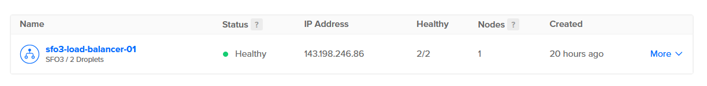
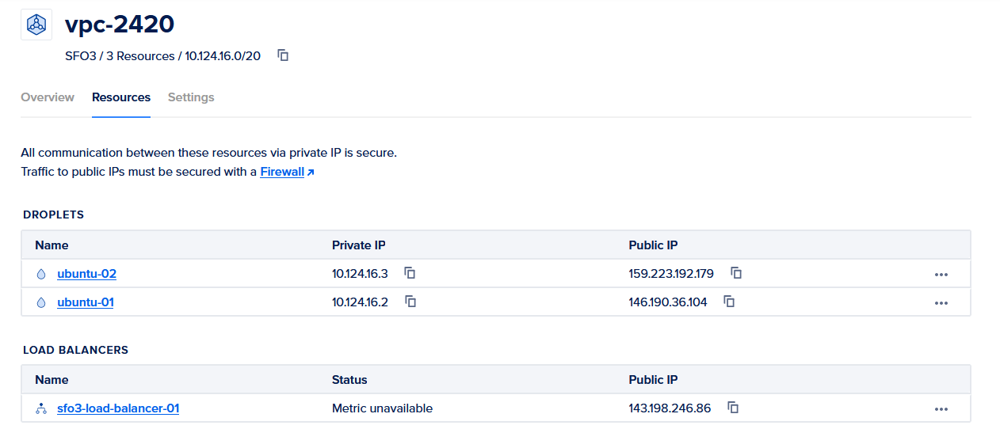
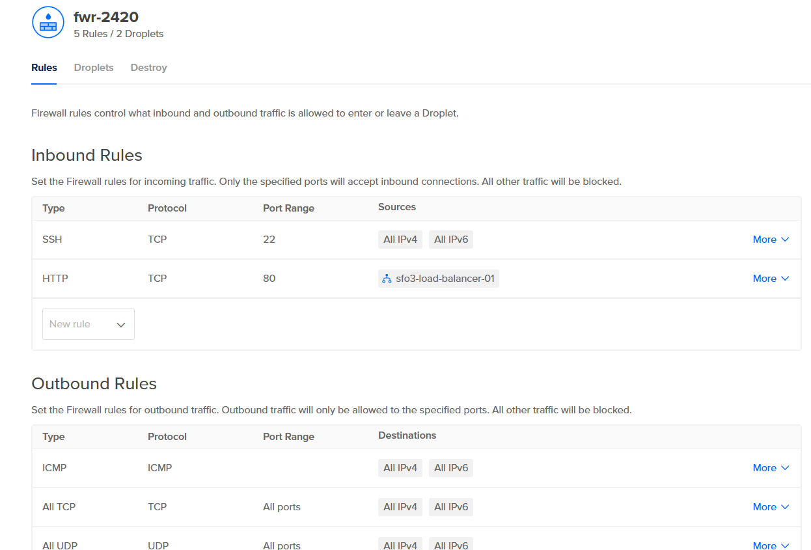

## Installing Caddy

To install Caddy, there will be a series of command you need to execute in your Droplet. 

The first command you'll run is:

```
    wget https://github.com/caddyserver/caddy/releases/download/v2.6.2/caddy_2.6.2_linux_amd64.tar.gz
```

This command will downloda you the .tar.gz file for Caddy into your Droplet, which will let run another command to unarchive the .tar.gz file, giving us an executable Caddy file.

To unarchive the file, we will use this command:

```
    tar xvf caddy_2.6.2_linux_amd64.tar.gz
```

After this, we will need to change Caddy file's ownership and group to root, and after that we will move the file over to /usr/bin/ To do so, we will use these two commands:

```
    sudo chown root: caddy
    sudo cp caddy /usr/bin/
```

This is what these commands executed should look like:

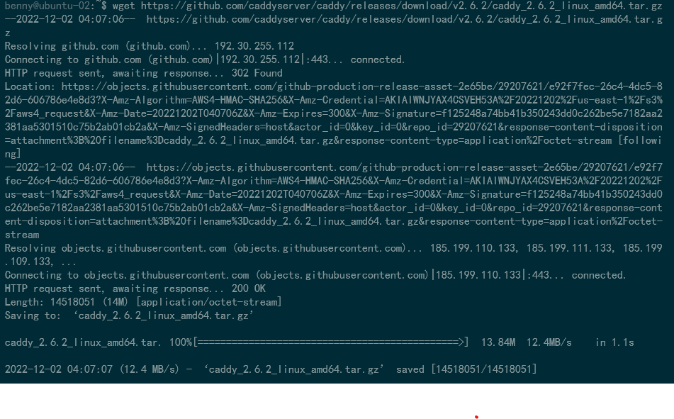
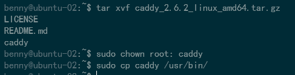

You will be doing this on both droplets so make sure you repeat these steps again for your other droplets. After this is done on both droplets, you should run this command:

```
    sudo apt update
    sudo apt upgrade
```

## Writing the Web App

We will create two new directories, one called html and one called src. Inside the html directory, we will create a html file named index.html. This is what I have used for the index.html. This index.html will be used in both of your droplets. Ensure that your html file on each droplet is different from each other so that you can differentiate between the two when testing if the load balancer is working or not.

```
    <!DOCTYPE html>
    <html>
    <head>
    <title>Droplet 1</title>
    </head>
    <body>

    <h1>My First Heading</h1>
    <p>Droplet 1.</p>

    </body>
    </html>
```

Inside the src directory, you will create your node application. You will need to change this node application slightly so that it is not the same to ensure that the load balancer is working properly. Inside both of your src directory, run the following commands to install fastify
```
    npm init
    npm i fastify
```
This should be what your terminal will look like for this step:
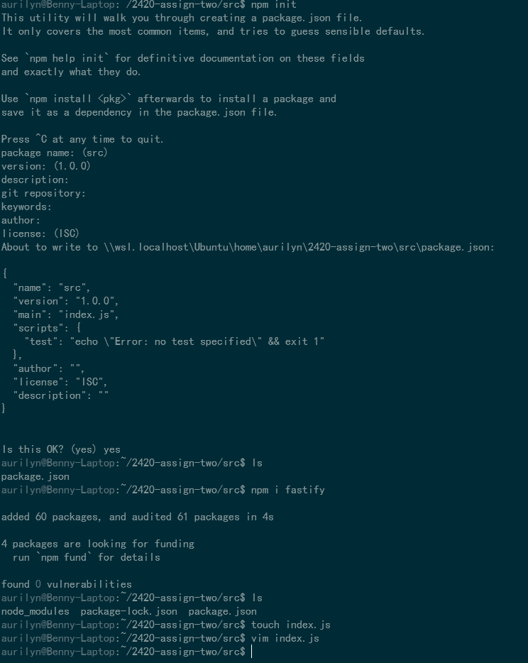

This is the index.js that you will create and put inside the src directory:

```
    // Require the framework and instantiate it
    const fastify = require('fastify')({ logger: true })

    // Declare a route
    fastify.get('/api', async (request, reply) => {
    // Change the json right here so that it displays something different on your 
    // second droplet
    return { hello: 'Server x' }
    })

    // Run the server!
    const start = async () => {
    try {
        await fastify.listen({ port: 5050 })
    } catch (err) {
        fastify.log.error(err)
        process.exit(1)
    }
    }
    start()
```

## Writing the Caddyfile and Caddy.service

We will write the Caddyfile, in addition to just the Caddyfile, we will add in a reverse proxy. The Caddyfile should look like this:

```
    http://143.198.246.86 {
	    root * /var/www
	    reverse_proxy /api localhost:5050
	    file_server
    }
```	

You will need to write a caddy.service file so that you can serve the html, to do so this is the content of your service file:
```
    [Unit]
    Description=Serve HTML in /var/www using caddy
    After=network.target

    [Service]
    Type=notify
    ExecStart=/usr/bin/caddy run --config /etc/caddy/Caddyfile
    ExecReload=/usr/bin/caddy reload --config /etc/caddy/Caddyfile
    TimeoutStopSec=5
    KillMode=mixed

    [Install]
    WantedBy=multi-user.target
```

## Installing Node and npm with Volta

To install Node and npm, we will utilize Volta. After installing Volta, we will need to source the .bashrc so that your shell will know where volta is located, and where npm and node is installed. The process to install node and npm will be documented in the screenshots below.

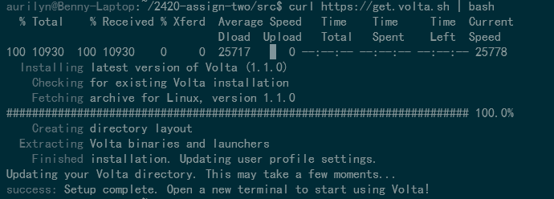
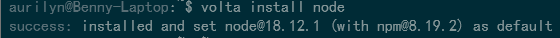
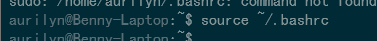

## Writing service file to start node application

We will need to write a service file to start the node application. We will be naming the service file hello_web.service and inside this is the content:

```
    [Unit]
    Description=service to start node, restart if fail
    After=network-online.target

    [Service]
    User=benny
    Group=benny
    Type=notify
    ExecStart=/home/benny/.volta/bin/node /home/benny/2420-assign-two/src/index.js
    Restart=on-failure

    [Install]
    WantedBy=multi-user.target
```

This ensures that the service is restarted upon failure.

## Uploading, Testing and Running Files

Once all the files have been created in your WSL, you will go into sftp and put each of the file into your home directory where you will have another directory set up that will hold all the files you need before moving them into the correct directories.

Once you are in sftp, type in this to put all your files from WSL to your droplet:
```
    put <file>
```

Make sure this is done within your directory where everything is being held.

This is also when you would change your index.js so that you can see the load balancer working properly.

You will move your caddy.service and your hello_web.service to /etc/systemd/system, to do so, you will need to type this in:

```
    sudo mv caddy.service /etc/systemd/system/
    sudo mv hello_web.servce /etc/systemd/system/
```

After this, you will need to create your src directory and move index.js and package.json into the src directory.

We will also put index.html into /var/www:
```
    sudo mv index.html /var/www/
```

Once the service has been moved, you will need to enable and start the service to ensure that it is working properly. To enable and start, type the following:

```
    sudo systemctl enable caddy.service
    sudo systemctl enable hello_web.service
    sudo systemctl start caddy.service
    sudo systemctl start hello_web.service
    sudo systemctl status caddy.service
    sudo systemctl status hello_web.service  
```

If everything is in the correct directory, you should be able to see both of these:
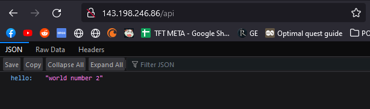
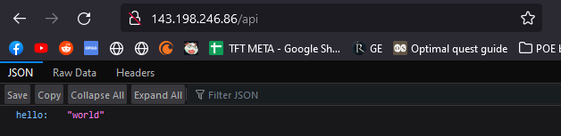

To help troubleshoot, these are where each file should be located in:
```
    caddy.service + hello_web.service should be located in /etc/systemd/system
    index.js should be located in /home/user/2420-assign-two/src
    index.html should be located in /var/www
    caddyfile should be located in /etc/caddy
```
